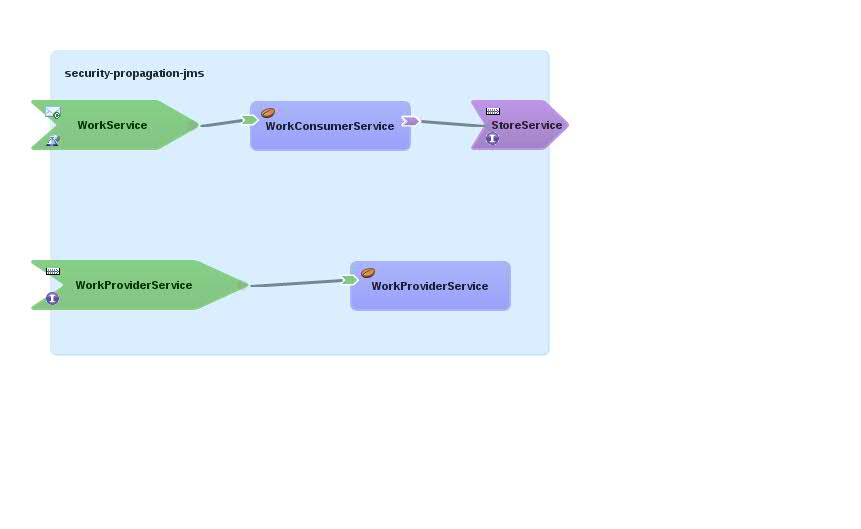

Introduction
============

This quickstart is based on [security-propagation-jms quickstart demo](../security-propagation-jms), but is propagating security credentials over JMS queue. There are two Bean service called **WorkConsumerService** and **WorkProviderService**.

**WorkConsumerService** requires both of _confidentiality_ and _clientAuthentication_ policy. SSL is used for _confidentiality_, and Basic Authentication is used for _clientAuthentication_.

**WorkProviderService** requires _clientAuthentication_, but it extracts security credentials from a message propagated over JMS queue.

**WorkConsumerService** receives a Work command through SOAP request and forwards it to **StoreService** which has camel-jms reference binding. When **StoreService** stores a Work command into **WorkStoreQueue**, custom MessageComposer
[SecurityCamelJMSMessageComposer](src/main/java/org/switchyard/quickstarts/demo/security/propagation/jms/security/SecurityCamelJMSMessageComposer.java)
extracts security credentials associated with the execution, and package it into **CredentialedWork** object with a original Work object.

As **WorkProviderService** has camel-jms service binding, it receives that stored **CredentialedWork** object. In this application,
[SecurityCamelJMSBindingDataCreator](src/main/java/org/switchyard/quickstarts/demo/security/propagation/jms/security/SecurityCamelJMSBindingDataCreator.java)
is loaded as a alternative BindingDataCreator to create
[SecurityCamelJMSBindingData](src/main/java/org/switchyard/quickstarts/demo/security/propagation/jms/security/SecurityCamelJMSBindingData.java), which extracts a original Work object and security credentials from 
[CredentialedWork](src/main/java/org/switchyard/quickstarts/demo/security/propagation/jms/security/CredentialedWork.java)
received from JMS queue. Then SwitchYard security component uses the extracted credentials to authenticate&authorize.

Running the quickstart
======================

EAP
----------

1. Start EAP in standalone-full mode:

        ${AS}/bin/standalone.sh --server-config=standalone-full.xml

2. Create an application user:

        ${AS}/bin/add-user.sh -a --user kermit --password the-frog-1 --group friend

3. Build and deploy the quickstart

        mvn install -Pdeploy

4. Execute the test. (See "Options" section below.)

5. Check the server console for output from the service.

6. Undeploy the application

        mvn clean -Pdeploy

Fuse
----------

Instead of steps 1-3,6 above for EAP...

1. Edit ${FUSE_HOME}/etc/org.ops4j.pax.web.cfg file, add the following contents:

        org.osgi.service.http.secure.enabled=true
        org.osgi.service.http.port.secure=8183
        org.ops4j.pax.web.ssl.keystore=quickstarts/switchyard/demos/security-propagation-jms/connector.jks
        org.ops4j.pax.web.ssl.keystore.type=JKS
        org.ops4j.pax.web.ssl.password=changeit
        org.ops4j.pax.web.ssl.keypassword=changeit
        org.ops4j.pax.web.ssl.clientauthwanted=false
        org.ops4j.pax.web.ssl.clientauthneeded=false

2. Add these lines to ${FUSE_HOME}/etc/users.properties:

        karaf=karaf,admin,manager,viewer,Monitor, Operator, Maintainer, Deployer, Auditor, Administrator, SuperUser
        kermit = the-frog-1,_g_:friend
        _g_\:friend = group,friend

5. Install the feature for the bean-service quickstart :

        karaf@root> features:install switchyard-demo-security-propagation-jms

6. When executing the test (as directed below), add the following system property: -Dorg.switchyard.component.soap.client.port=8183

        mvn exec:java -Dexec.args="confidentiality clientAuthentication" -Djavax.net.ssl.trustStore=connector.jks -Dorg.switchyard.component.soap.client.port=8183

Karaf
----------

Instead of steps 1-3,6 above for EAP...

1. Create a ${KARAF}/quickstarts/demos/security-propagation-jms/ directory, and copy connector.jks into it.

2. Create a ${KARAF}/etc/org.ops4j.pax.web.cfg file, with the following contents:

        org.osgi.service.http.enabled=true
        org.osgi.service.http.port=8181
        org.osgi.service.http.secure.enabled=true
        org.osgi.service.http.port.secure=8183
        org.ops4j.pax.web.ssl.keystore=quickstarts/demos/security-propagation-jms/connector.jks
        org.ops4j.pax.web.ssl.keystore.type=JKS
        org.ops4j.pax.web.ssl.password=changeit
        org.ops4j.pax.web.ssl.keypassword=changeit
        org.ops4j.pax.web.ssl.clientauthwanted=false
        org.ops4j.pax.web.ssl.clientauthneeded=false

3. Add this line to ${KARAF}/etc/users.properties:

         kermit = the-frog-1,_g_:friend
         _g_\:friend = group,friend

4. Add the features URL for the respective version of SwitchYard.   Replace {SWITCHYARD-VERSION}
with the version of SwitchYard that you are using (ex. 2.0.0):

        karaf@root> features:addurl mvn:org.switchyard.karaf/switchyard/{SWITCHYARD-VERSION}/xml/features

5. Install the feature for the bean-service quickstart :

        karaf@root> features:install switchyard-demo-security-propagation-jms

6. When executing the test (as directed below), add the following system property:

        mvn exec:java -Dexec.args="confidentiality clientAuthentication" -Djavax.net.ssl.trustStore=connector.jks -Dorg.switchyard.component.soap.client.port=8183

Wildfly
----------

1. Create an application user:

        ${AS}/bin/add-user.sh -a --user kermit --password the-frog-1 --group friend

2. Start Wildfly in standalone mode :

        ${AS}/bin/standalone.sh

3. Build and deploy the demo :

        mvn install -Pdeploy -Pwildfly

4. Execute the test. (See "Options" section below.)

5. Check the server console for output from the service.

6. Undeploy the application

        mvn clean -Pdeploy -Pwildfly

Warning --> Wildfly 8.0.0 When the application is undeployed, it is required to restart the server to get all the undeployment changes done.

Options
=======

When running with no options:

        mvn exec:java

You will be hitting the http (non-SSL) URL, and see this in your log:

        Caused by: org.switchyard.exception.SwitchYardException: Required policies have not been provided: authorization clientAuthentication confidentiality

When running with this option:

        mvn exec:java -Dexec.args="confidentiality clientAuthentication" -Djavax.net.ssl.trustStore=connector.jks

You will be hitting the https (SSL) URL and providing authentication information, and see this in your log:

        :: WorkConsumerService :: Received work command => CMD-1456133194973 (caller principal=kermit, in roles? 'friend'=true 'enemy'=false) :: Forwarding to StoreService
        SecurityContext is detected - storing credentials into camel message
        Creating org.switchyard.quickstarts.demo.security.propagation.jms.security.SecurityCamelJMSBindingData
        Security Credential is found in camel message - extracting.
        :: WorkProviderService :: Received work command => CMD-1456133194973 (caller principal=kermit, in roles? 'friend'=true 'enemy'=false) :: Creating a WorkAck
        :: WorkProviderService :: Returning workAck command => CMD-1456133194973 (Received=true, caller principal=kermit, in roles? 'friend'=true 'enemy'=false)
        :: WorkConsumerService :: Received workAck command => CMD-1456133194973 (Received=true, caller principal=kermit, in roles? 'friend'=true 'enemy'=false)

(Because the WorkConsumerService is secured, you will see the not-null principal, and true for the expected security role.)

============
If you

1. Disable the **SecurityCamelJMSMessageComposer** on **StoreService** reference
2. Remove _clientAuthentication_ policy from **WorkProviderService/WorkProviderService**
3. Remove _authorization_ policy from **WorkProviderService** implementation

then **WorkProviderService** is able to receive a request without security credentials. You will see ERROR message from it indicating that the **WorkProviderService** can't see the caller is in "friend" role, therefore marks it received="false" while **WorkConsumerService** can.

    :: WorkProviderService :: Returning workAck command => CMD-1456147192440 (Received=false, caller principal=null, in roles? 'friend'=false 'enemy'=false)
    :: WorkConsumerService :: Received workAck command => CMD-1456147192440 (Received=false, caller principal=kermit, in roles? 'friend'=true 'enemy'=false)
